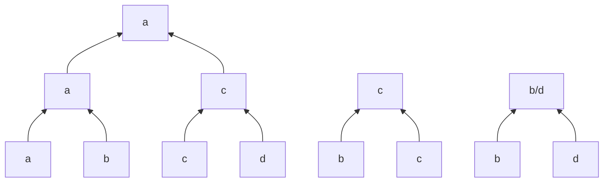

# hw2 刘佳璇 231220105

# 第四章

## 4.1 叶节点数量

证明：

​	当二叉树为满二叉树时，$L=2^h$；当二叉树不是满二叉树时，增加节点会使叶节点数量不变或 +1. 故 $L\le 2^h.$ 

## 4.4 元素排序问题

1）

​	采用锦标赛排序算法。假设 4 个元素为 a, b, c, d，以下是比较次数最多的情况（图中子节点为双亲节点中的较小者）。



2）

​	同样采用锦标赛排序，最坏情况下需比较 7 次。

## 4.8 k-sorted

​	采用线性排序算法，如基数排序。


## 4.9 匹配螺钉和螺母

​	任取一个螺钉与所有螺母匹配，找到匹配的螺母，并将其余所有螺母分为”小于该螺钉“、“大于该螺钉”两堆。再用匹配上的螺母与其余所有螺钉匹配，将螺钉分为“ 小于该螺母”、大于该螺母“两堆。对两堆对应的螺钉和螺母重复以上操作。

​	每一轮遍历匹配操作的时间复杂度为 $\Omicron(n)$，共进行 $\log{n}$ 轮，故算法的时间复杂度为 $\Omicron(n\log[n]).$ 

## 4.11 逆序对

1）

证明：

​	采用反证法。假设 $(i,j)$ 为逆序对且 $j-i>2$，则考虑子数组 $A[i],A[i+1],A[i+2],\cdots,A[j].\;\forall\, k\in(i,j),\;A[k]$ 的取值有三种可能：

​	①若 $A[k]<A[j]<A[i]$，则有逆序对 $(i,k)$；

​	② 若 $A[j]<A[k]<A[i]$，则有逆序对 $(i,k),\,(k,j)$；

​	③若 $A[j]<A[i]<A[k]$，则有逆序对 $(k,j)$。

​	为尽量减少逆序对的数量，假设 $\forall\,i<k<m<j,\;A[k]<A[m]$ ，则除了 $(i,j)$ 以外，$A[k],\;A[m]$ 至少贡献两个逆序对，与原命题矛盾。故假设不成立，即 $j-i\le 2.$ 

2）

​	算法主干为依次比较 $A[i]$ 与 $A[i+1]$，最坏情况需比较 $n-1$ 次；当有 2 个逆序对时，可能需要额外比较一次。故最坏情况下需比较 $n$ 次。

```c++
bool is_inversion = 0;
for i=1 to n-1 do
{
    if A[i]>A[i+1]
    {
        if i==n
            swap(A[i], A[i+1]); 
        	is_inversion=0;
        else if is_inversion==1
            swap(A[i-1], A[i+1]); 
        	is_inversion=0; 
        else if A[i-1]>A[i+1]
            swap(A[i-1], A[i], A[i+1]) to (A[i+1], A[i-1], A[i+1]);
        	is_inversion=0; 
        else
            is_inversion=1;
    }
    else
    {
        if is_inversion==1
            if A[i-1]>A[i+1]
         	   swap(A[i-1], A[i], A[i+1]) to (A[i], A[i+1], A[i-1]);
        		is_inversion=0; 
        	else
                swap(A[i-1], A[i]); 
        		is_inversion=0; 
    }
}
```

## 4.14 易位词

​	先提取出英文文件中的所有单词，并按单词长度分组。将单词内部按字典序重排，然后在各个组内对排序后的单词进行排序。相邻且相同的单词即为易位词。


# 第七章

## 7.1 逆序对计数问题的推广

​	对数组进行遍历检查逆序对，时间复杂度为 $\Omicron(n^2).$ 

## 7.4 合并有序数组

1）

​	$T(n)=\sum_\limits{i=1}^{k-1}(i\cdot n+n)=\dfrac{(k-1)(k+2)}{2}\cdot n=\Omicron(k^2n).$ 

2）

​	同时对 $k$ 个数组采用合并排序中的合并方法，其中采用最小堆选择 $k$ 个元素中的最小者。每次选择最小元素的时间复杂度为 $\log{k}$，一共进行 $n\cdot k$ 次选择，故时间复杂度为 $\Omicron(nk\log{k}).$ 

## 7.5 二叉树

1）

​	记树的高度为 $h$，则 $h=max(h_{left},\,h_{right})+1.$ 

​	$T(n)=T(n_{left})+T(n_{right})+1=\Omicron(n).$ 

2）

​	记树的直径为 $d$，则 $d=max(d_{left},\,d_{right},\,h_{ldft}+h_{right}+2).$ 

​	$S(n)=S(n_{left})+S(n_{riht})+T(n_{left})+T(n_{right})+1=\Omicron(n).$ 

## 7.8 寻找 maxima

1）

​	可以排序：先对所有点的横坐标 $x$ 进行排序，得到序列 $X[1\dots n]$，然后按下标从大到小进行遍历

```c++
maxima_y=0;
for i=n to 1
{
	if (X[i].y > maxima_y)
	{	
        X[i] is maxima;
    	maxima_y = X[i].y;
    }
}
```

​	不能排序：

2）

​	①

​	②

3）

​	基于比较的排序算法的时间复杂度为 $\Omega(n\log{n})$，故基于比较寻找 maxima 的算法的时间复杂度不可能为 $\omicron(n\log{n})$。

## 7.12 寻找缺失的比特串

1）

​	所有可能的 $2^k$ 个 $k$ 比特串应该满足每一位共有 $2^{k-1}$ 个 $0$ 和 $2^{k-1}$ 个 $1$，故遍历 $k$ 行，找出每一行缺失的 $0$ 或 $1$，即可拼出缺失的比特串。

2）

​	假设二位比特数组中的比特串为 $s_i[1\dots k]\;(i\in(1,n))$，缺失的比特串为 $m[1\dots k]$，与 1）类似地，先遍历第一行，确定 $m[1]=b_1$，接下来只考虑集合 $\{\forall i,\;s_i[1]=b_1\;|\;s_i[2\dots k]\;\}$；重复上述步骤。

​	$T(n)=\sum_\limits{i=1}^k 2^k-1=2^{k+1}-2-\dfrac{k(k+1)}{2}=2n-\dfrac{k(k+1)}{2}=\Omicron(n).$ 

# 第十四章

## 14.1 $\log$ 的性质证明

证明：

​	对于堆，$\lceil\log{(h+1)}\rceil$ 为查找一个节点所需的时间复杂度，$\lceil\log{(\lfloor\dfrac{h}{2}\rfloor+1)}\rceil$ 为查找它的父节点所需的时间复杂度，而后者再查找一次即可得到前者，故 $\lceil\log{(\lfloor\dfrac{h}{2}\rfloor+1)}\rceil+1=\lceil\log{(h+1)}\rceil.$ 

## 14.2 堆中第 $k$ 大的元素

​	只取堆的前 $k$ 层，进行 $k$ 次 pop 操作，每次调整的时间复杂度为 $\log{2^k}\Omicron(k)$，总体的时间复杂度为 $\Omicron(k^2).$ 

## 14.3 $d$ 叉堆

1）

证明：

​	下标为 $m$ 的节点，它的子节点下标为 $d(m-1)+2$ 到 $dm+1$。令子节点下标为 $i$，则 $i\in[\,d(m-1)+2,\,dm+1\,]$，即 $m=\lfloor\dfrac{i-2}{d}+1\rfloor$。

2）

证明：

​	同上所述，下标为 $i$ 的节点的第 $j$ 个子节点下标为 $d(i-1)+2+j-1=d(i-1)+j+1$。

## 14.4 节点高度和

证明：

​	假设堆的高度为 $H$，则对于完美堆，共有 $n=2^{H+1}-1$ 个节点，所有节点的高度之和为
$$
H(n)=\sum_{i=0}^{H}(i\cdot2^{H-i})=2^{H+1}-H-2=n-1-H<n-1
$$
​	当堆不是完美堆时，假设堆比起完美堆缺失了 $m\;(m\in[1,\;2^H-1])$ 个节点，则 $n=2^{H+1}-1-m$，$H(n)$ 减少了 $D(m)=\sum_\limits{i=1}^\infin\lfloor\dfrac{m}{2^i}\rfloor$，所有节点的高度之和为
$$
H'(n)=H(n)-D(m).
$$
​	考虑 $n-1-H'(n)=H-(m-D(m))$ 为与 $m$ 有关的函数，且随 $m$ 增大，函数值不增。因此当 $m$ 取最大值 $2^H-1$ 时，函数取得最小值 $0$，即 $H'(n)\le n-1$。

​	综上所述，原命题成立且在 $m=2^H-1,\;n=2^H$ 时取等。

## 14.5 有序链表合并算法

​	

## 14.6 动态发现中值