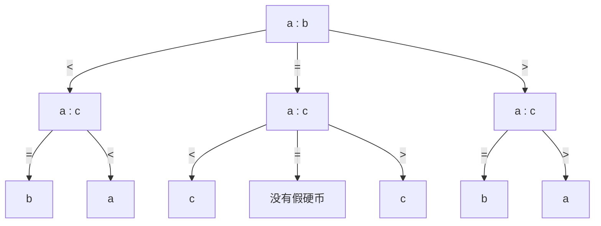

# hw3 刘佳璇 231220105

## 第五章

### 5.2  $6$ 次比较找出 $5$ 个元素的中位数

​	假设五个元素为 $a, b, c, d, e$ ，令 $a, b$ 一组，$c, d$ 一组，$e$ 单独一组。组内进行比较，假设比较结果为 $a>b,\; c>d$ ，再比较 $a, c$ ，假设结果为 $a>c$。则目前得到信息 $a>c>d,\; a>b$ 。 $a$ 比 $b, c, d$ 都大，不可能是中位数，淘汰 $a$。重复上述操作，将 $e, b$ 重新并为一组，进行比较，假设结果为 $b>e$ ，再比较 $b, c$ ，假设结果为 $b>c$ 。则目前得到信息 $b>c>d,\; b>e$。 $b$ 比 $c, d, e$ 都大，不可能是中位数，淘汰 $b$。在 $c, d, e$ 中，有已知信息 $c>d$，再比较 $c, e$ 即可得到 $c, d, e$ 中最大的数，即为五个元素的中位数。

### 5.4 阶为 $i$ 的元素

​	因为算法只用比较来确定阶为 $i$ 的元素，所以必须得到的信息有该元素比 $i-1$ 个元素大，比 $n-i$ 个元素小。因此不需要另外的比较操作。

### 5.5 “黑盒”算法

​	假设一共有 $n$ 个元素。用算法 $\mathcal{A}$ 选的中位数作为 $pivot$ ，对 $n$ 个元素进行 $partition$ ，若 $pivot\neq k$ ，则对左右两个部分中的一个递归地进行选择。算法 $\mathcal{B}$ 的时间复杂度为 $T(n)\le n+\dfrac{n}{2}+\dfrac{n}{2^2}+\cdots=\Omicron(n)$ 。

### 5.6 最大的 $k$ 个元素

1）$\Omicron(n\log{n})$

​	用归并排序 $\Omicron(n\log{n})$ 对整个数组进行排序。

2）$\Omicron(n+k\log{n})$

​	 $\Omicron(n)$ 建立最大堆，然后弹出 $k$ 次堆顶，每次弹出需要 $\Omicron(k\log{n})$ 。

3）$\Omicron(n+k^2)$

​	先用线性时间选择算法 $\Omicron(n)$ 找出前 $k$ 大的元素，然后用选择排序算法 $\Omicron(k^2)$ 对前 $k$ 大的元素进行排序。

4）$\Omicron(n+k\log{k})$

​	先用线性时间选择算法 $\Omicron(n)$ 找出前 $k$ 大的元素，然后用快速排序算法 $\Omicron(k\log{k})$ 对前 $k$ 大的元素进行排序。

### 5.7 和中位数大小最接近的 $k$ 个数

1）$\Omicron(n\log{n}+k)$

​	先用归并排序 $\Omicron(n\log{n})$ 对整个数组进行排序，假设排好后 $M$ 的下标为 $m$ 。用以下算法选出和 $M$ 最接近的 $k$ 个数，时间复杂度为 $\Omicron(k)$ ：

```c++
int i = m - 1;
int j = m + 1;
for x = 1 to k do
{
    if |S[i]-M| < |S[j]-M|
    {
        choose S[i];
        i--;
    }
    else
    {
        choose S[j];
        j++;
    }
}
```

2）$\Omicron(n+k\log{k})$

​	先用线性选择算法 $\Omicron(n)$ 选出中位数 $M$ ，比 $M$ 大的部分建立最小堆 $H\_min$ ，比 $M$ 小的部分建立最大堆 $H\_max$ ，建立堆的总时间复杂度为 $\Omicron(n)$ 。然后用以下算法选出和 $M$ 最接近的 $k$ 个数（只对两个堆的前 $k$ 层进行调整），时间复杂度为 $\Omicron(k\log{k})$ ：

```
for x = 1 to k do
{
	if |H_min.top-M| < |H_max.top-M|
	{
		choose H_min.top;
		H_min.pop();
	}
	else
	{
		choose H_max.top;
		H_max.pop();
	}
}
```

### 5.9 并集中阶为 $k$ 的元素

1）

​	先比较 $A[\dfrac{k}{2}]$ 和 $B[\dfrac{k}{2}]$ 。假设 $A[\dfrac{k}{2}]<B[\dfrac{k}{2}]$ ，则对子问题进行递归：寻找 $A[\dfrac{k}{2}+1,\dots n]$ 和 $B[1,\dots\dfrac{k}{2}]$ 中阶为 $\dfrac{k}{2}$ 的元素。

​	重复递归，直至以下情况：

​		若 $k=1$ ，则返回 $min(A[1],B[1])$ ；

​		若其中一个数组为空（假设为 $A$ ），则返回 $B[k]$ 。

2）

​	先比较 $A[\dfrac{k}{3}]，\; B[\dfrac{k}{3}]$ 和 $C[\dfrac{k}{3}]$ 。假设 $A[\dfrac{k}{3}]<B[\dfrac{k}{3}]<C[\dfrac{k}{3}]$ ，则对子问题进行递归：寻找 $A[\dfrac{k}{3}+1,\dots n],\;B[1\dots n]$ 和 $C[1,\dots\dfrac{k}{3}]$ 中阶为 $\dfrac{2k}{3}$ 的元素。

​	重复递归，直至以下情况：

​		若 $k=1$ ，则返回 $min(A[1],B[1],C[1])$ ；

​		若 $k=2$ ，则先选出 $min(A[1],B[1],C[1])$ （假设为 $A[1]$ ），然后返回 $min(A[2],B[1],C[1])$ ；

​		若其中两个数组为空（假设为 $A,B$ ），则返回 $C[k]$ 。	 

3）

​	先选出 $min(A[i][\dfrac{k}{m}])$ 和 $max(A[i][\dfrac{k}{m}])(i=1\dots m)$ ，假设分别为 $A[1][\dfrac{k}{m}]$ 和 $A[m][\dfrac{k}{m}]$ ，则对子问题进行递归：寻找 $A[1][\dfrac{k}{m}+1\dots n],\;A[i][1\dots n],\;A[m][1\dots\dfrac{k}{m}]\;(i=2,\dots,m-1)$ 中阶为 $\dfrac{m-1}{m}k$ 的元素。
​	重复递归，直至 $k\in[1,\,m-1)$ ，此时重复 $k$ 次取 $A[i][\dfrac{k}{m}]\,(i=1\dots m)$ 最小值的操作即可。

时间复杂度分析：

​	$T(k)=T(\dfrac{m-1}{m}k)+O(m)$， 递归次数 $r=\log{k}$ 。递归至 $k\in[1,\,m-1)$ 后，后续取最小值的时间复杂度为 $\Omicron(km)$ 。


### 5.10 加权中位数

1）

​	当 $w_i=\dfrac{1}{n}(u=1,2,\dots,n)$ 时， $x_1,x_2,\dots,x_n$ 的中位数为第 $k=\lfloor\dfrac{n+1}{2}\rfloor$ 个元素。有
$$
\sum_{x_i<x_k}w_i=\lfloor\dfrac{n-1}{2}\rfloor<\dfrac{1}{2},\;\sum_{x_i>x_k}w_i=\lceil\dfrac{n-1}{2}\rceil\le\dfrac{1}{2}\quad\quad\qquad\qquad\qquad
$$
​	故 $x_k$ 为加权中位数。

2）$\Omicron(n\log{n})$

​	先用归并排序算法 $\Omicron(n\log{n})$ 将 $n$ 个元素按权重排序，然后依次累加元素权重 $\Omicron(n)$ ，求得加权中位数。

3）$\Omicron(n)$

​	先用线性时间选择算法 $\Omicron(n)$ 选取中位数，求得左右两个部分的权值和 $Omicron(n)$ ，若都小于 $\dfrac{1}{2}$ ，则选出的中位数就是加权中位数；否则在权值和大于 $\dfrac{1}{2}$ 的部分递归求解。

​	$T(n)=T(\dfrac{1}{2})+\Theta(n)\Rightarrow T(n)=\Theta(n)$  


## 第六章

### 6.2 计算 $\lfloor\sqrt{N}\rfloor$

​	改进平方运算操作：假设计算 $m^2$ 时，查询的左右边界分别为 $a,\,b$ ，则 $m^2=(\dfrac{a+b}{2})^2=\dfrac{1}{4}a^2+\dfrac{1}{4}b^2+2ab$ 。假设 $m^2<N$ ，则下一次递归在 $(m,b)$ 之间查找， $m'\,^2=\left(\dfrac{\dfrac{a+b}{2}+b}{2}\right)^2=\dfrac{1}{16}a^2+\dfrac{9}{16}b^2+\dfrac{3}{8}ab$，$m^2>N$ 的情况对称。由此，在每一次递归中， $m^2$ 均可以写作 $a^2,b^2,ab$ 的线性组合；而第一次递归时 $a=1,b=N$ 。因此每次平方运算操作的时间复杂度为 $\Omicron(1)$ ，算法总的时间复杂度为 $\Omicron(n)$ 。 

### 6.3 红黑树的等价定义

考虑递归定义：

​	当 $h=0$ ，定义 $RB_0$ 为唯一一个外部节点构成的红黑树，与直接定义一致；

​	当 $h>0$ ，

​			若红黑树 $RB_{h-1}$ 作为红色根节点的子树，外部节点的黑色高度须加上 $RB_{h-1}$ 根节点的高度 $1$ ，即更新后的黑色高度为 $h$ ，得到准红黑树 $ARB_h$ ；

​			若红黑树 $RB_{h-1}$ 作为黑色根节点的子树，外部节点的黑色高度须加上 $RB_{h-1}$ 根节点的高度，即更新后的黑色高度为 $h$ ，得到红黑树 $RB_h$ ；

​			若准红黑树 $ARB_h$ 作为黑色根节点的子树，外部节点的黑色高度不变，即更新后的黑色高度为 $h$ ，得到红黑树 $RB_h$ ；

​	如此递归，满足红黑树根节点为黑色，所有外部节点为黑色且高度一致，红色节点不连续出现，即递归定义与直接定义等价。

### 6.4 红黑树的平衡性

**引理 6.1**

假设 $T$ 为一棵 $RB_h$ ，则：

1）$T$ 有不少于 $2^h-1$ 个内部黑色节点

证明：

​	当 $h=0$ ，内部黑色节点的个数为 $n_{ib}(0)=0=2^0-1$ ；

​	当 $h>0$ ， $T$ 的根节点是一个内部黑色节点，它的子树可能是 $RB_{h-1}$ 或 $ARB_h$ 。对于子树 $RB_{h-1}$ ，它为 $T$ 提供 $n_{ib}(h-1)\ge2^{h-1}-1$ 个内部黑色节点；对于子树 $ARB_h$，它有两个子树 $RB_{h-1}$ ，共为 $T$ 提供 $2n_{ib}(h-1)\ge 2^{h}-2$ 个内部黑色节点 。因此， $T$ 的子树为两个 $RB_{h-1}$ 时，内部黑色节点个数最少，为 $n_{ib}(h)=2n_{ib}(h-1)+1\ge 2^h-1$ 个。

​	故结论成立。

2）$T$ 有不超过 $4^h-1$ 个内部节点

证明：

​	当 $h=0$ ，内部节点的个数为 $n_i(0)=0=4^0-1$ ；

​	当 $h>0$ ， $T$ 的根节点是一个内部节点，它的子树可能是 $RB_{h-1}$ 或 $ARB_h$ 。对于子树 $RB_{h-1}$ ，它为 $T$ 提供 $n_{i}(h-1)\le4^{h-1}-1$ 个内部节点；对于子树 $ARB_h$，它有两个子树 $RB_{h-1}$ ，共为 $T$ 提供 $2n_{i}(h-1)+1\le2\cdot 4^{h-1}-1$ 个内部节点 。因此， $T$ 的子树为两个 $ARB_{h-1}$ 时，内部节点个数最多，为 $n_{i}(h)=2(2n_{i}(h-1)+1)+1\le 4^h-1$ 个。

​	故结论成立。

3）任何黑色节点的普通高度至多是其黑色高度的 $2$ 倍

证明：

​	当黑色节点到根节点的路径上，除根节点外所有节点都是黑色节点时，普通高度为 $h$ ；当路径上的节点黑红相间时，普通高度为 $2h$ 。故结论成立。

**引理 6.2**

假设 $T$ 为一棵 $ARB_h$ ，则：

1）$T$ 有不少于 $2^h-2$ 个内部黑色节点

证明：

​	当 $h=1$ ，内部黑色节点的个数为 $n_{ib}(0)=0=2^1-2$ ；

​	当 $h>1$ ， $T$ 的根节点不是内部黑色节点，它的子树是两个 $RB_{h-1}$ 。对于子树 $RB_{h-1}$ ，它为 $T$ 提供 $n_{ib}(h-1)\ge2^{h-1}-1$ 个内部黑色节点。因此， $T$ 的内部黑色节点个数为 $n_{ib}(h)=2n_{ib}(h-1)\ge 2^h-2$ 个。

​	故结论成立。

2）$T$ 有不超过 $\dfrac{1}{2}4^h-1$ 个内部节点

证明：

​	当 $h=1$ ，内部节点的个数为 $n_{ib}(0)=1=\dfrac{1}{2}4^1-1$ ；

​	当 $h>1$ ， $T$ 的根节点是一个内部节点，它的子树是两个 $RB_{h-1}$ 。对于子树 $RB_{h-1}$ ，它为 $T$ 提供 $n_{i}(h-1)\le4^{h-1}-1$ 个内部节点。因此， $T$ 的内部节点个数为 $n_{i}(h)=2n_{i}(h-1)+1\le \dfrac{1}{2}4^h-1$ 个。

​	故结论成立。

3）任何黑色节点的普通高度至多是其黑色高度的 $2$ 倍

证明：

​	当黑色节点到根节点的路径上，除根节点外所有节点都是黑色节点时，普通高度为 $h$ ；当路径上的节点黑红相间时，普通高度为 $2h-1$ 。故结论成立。

### 6.5  $a_i=i$

​	采用折半查找。对数组 $A[1\dots n]$ ，先查找中间元素 $A_{m}$ ，若 $A_{m}=m$ 则返回，若 $A_{m}\neq m$ ，考虑两种情况：如果 $A_{m}>m$ ，则对左半部分递归查找；如果 $A_m<m$ ，则对右半部分递归查找。若递归至数组左边界大于右边界，则查找失败。

### 6.8 寻找整数对

1）乱序数组求 $|x-y|_{max}$ ，要求 $\Omicron(n)$ 

​	原问题即求乱序数组的最大值和最小值。采用朴素的遍历查找即可。

```c++
int min = max = S[1];
for i = 2 to n do
{
	if S[i] < min then
		min = S[i];	
	else if S[i] > max then
		max = S[i]
}
```

2）有序数组求 $|x-y|_{max}$ ，要求 $\Omicron(1)$ 

​	取 $S[1]$ 和 $S[n]$ 即可。

3）乱序数组求 $|x-y|_{min}$ ，要求 $\Omicron(n\log{n})$ 

​	先用归并排序算法 $\Omicron(n\log{n})$ 将数组排序，然后遍历相邻元素的差 $\Omicron(n)$ 。

4）有序数组求 $|x-y|_{min}$ ，要求 $\Omicron(n)$ 

​	朴素遍历相邻元素的差 $\Omicron(n)$ 即可。

### 6.14 数组上的“局部最小元素”

1）

证明：

​	假设不存在局部最小元素。为保证 $A[2]$ 不是局部最小元素，有 $A[2]\ge A[3]$ ；同样为保证 $A[3\dots n-1]$ 不是局部最小元素，有 $A[i]\ge A[i+1]\;(2\le i \le n-2)$ 。但由于 $A[n-1]\le A[n]$ ，所以 $A[n-1]$ 是局部最小元素。故假设不成立，即至少存在一个局部最小元素。

2）

​	因为数组中至少存在一个局部最小元素，所以数组不严格单调。采用折半查找。对数组 $A[1\dots n]$ ，先查找中间元素 $A[m]$ ，若 $A[m-1]\ge A[m],\,A[m+1]\ge A[m]$ 则返回，否则考虑两种情况：如果 $A[m-1]\le A[m]\le A[m+1]$ ，则在左半部分递归查找；如果 $A[m-1]\ge A[m]\ge A[m+1]$ ，则在右半部分递归查找。


## 第十五章

### 15.1 实现并查集

1）基于矩阵

​	用矩阵 $A[n][n]$ 表示 $n$ 个元素的关系， $A[i,\,j]=true$ 则 $i$ 和 $j$ 有等价关系，反之没有。初始化矩阵：$\forall\;i\neq j,\;A[i,\,i]=true,\;A[i,\,j]=false$  。

​	 $FIND$ 操作：判断元素 $i,j$ 是否具有等价关系，不需要比较代表元，只需要判断 $A[i,\,j]$ 的布尔值，时间复杂度为 $\Omicron(1)$ 。

​	 $UNION(i,\,j)$ 操作：令 $A[i][k]=A[j][k]=A[i][k]\;or\;A[j][k]\,(k=1,\dots,n)$ ，时间复杂度为 $\Omicron(n)$ 。

​	总的时间复杂度为 $\Omicron(nl)$ 。

2）基于数组

​	用数组 $E[1\dots n]$ 的元素 $E[i]$ 记录元素 $i$ 所在等价类的代表元。初始化数组 $E[1\dots n]$ 的元素为 $-1$ 。

​	 $FIND(i)$ 操作：采用递归算法，返回 $FIND[E[i]]$ 。若 $FIND(i)=FIND(j)$ 则   $i$ 和 $j$ 有等价关系，反之没有。时间复杂度为 $\Omicron(n)$ 。

​	 $UNION(i,\,j)$ 操作：记 $root_i=FIND(i),\;root_j=FIND(j)$ ，若 $|E[root_i]|<|E[root_j]|$ ，则 $E[root_j]+=E[root_i],\;E[root_i]=root_j$ ，否则做对称的操作。时间复杂度为 $\Omicron(n)$ 。

​	总的时间复杂度为 $\Omicron(nl)$ 。

### 15.3  $n$ 个变量的 $m$ 个约束

​	建立变量 $x_1,\dots,x_n$ 的并查集，用等式约束对并查集做合并操作。然后对不等式约束 $x_i\neq x_j$ ，判断 $x_i,\,x_j$ 是否具有等价关系，若具有，则约束不可以同时满足；若遍历完所有不等式约束都没找到冲突，则约束可以同时满足。


## 第十六章

### 16.1 封闭寻址机制哈希到特定位置的概率

证明：

​	一个关键字哈希到某个特定地址的概率是 $\dfrac{1}{n}$ ，恰有 $k$ 个关键字哈希到该地址的概率是 $(\dfrac{1}{n})^k(1-\dfrac{1}{n})^{n-k}$ ，而 $k$ 个关键字有 ${n \choose k}$ 种选择方式，故正好有 $k$ 个关键字哈希到某个特定地址的概率是
$$
Q_k=(\dfrac{1}{n})^k(1-\dfrac{1}{n})^{n-k}{n \choose k}. 
$$
​	

### 16.4 不同哈希表的存储效率

1）

​	令负载因子为 $\alpha$ ，则元素数量 $n=\alpha h_C$ 。对于封闭寻址机制，有 $h_C$ 个链表头，每个链表头需要一个单位的存储空间；有 $n$ 个链表节点，每个链表节点需要两个单位的存储空间，故总共需要 $(1+2\alpha)h_C$ 个单位的存储空间，当 $\alpha=0.25,\,0.5,\,1,\,2$ 时分别为 $1.5\,h_C,\,2\,h_C,\,3\,h_C,\,5\,h_C$ 。

​	同样的空间用于开放寻址哈希表，哈希表大小为 $(1+2\alpha)h_C$ ，元素数量为 $\alpha h_C$ ，故负载因子为 $\dfrac{\alpha h_C}{(1+2\alpha)h_C}=\dfrac{\alpha}{1+2\alpha}$ ，当 $\alpha=0.25,\,0.5,\,1,\,2$ 时分别为 $\dfrac{1}{6},\,\dfrac{1}{4},\,\dfrac{1}{3},\,\dfrac{2}{5}$ 。

2）

​	对于封闭寻址机制，总共需要 $(1+5\alpha)h_C$ 个单位的存储空间，当 $\alpha=0.25,\,0.5,\,1,\,2$ 时分别为 $2.25\,h_C,\,3.5\,h_C,\,6\,h_C,\,11\,h_C$ 。

​	同样的空间用于开放寻址哈希表，哈希表大小为 $\dfrac{(1+5\alpha)h_C}{4}$ ，元素数量为 $\alpha h_C$ ，故负载因子为 $\dfrac{4\alpha}{1+5\alpha}$ ，当 $\alpha=0.25,\,0.5,\,1,\,2$ 时分别为 $\dfrac{4}{9},\,\dfrac{4}{7},\,\dfrac{2}{3},\,\dfrac{8}{11}$ 。

## 第十八章

### 18.1 $LAKE\_VIEW$ 算法

1）

证明：

​	循环不变式为：对当前循环已经遍历的元素，栈 $S$ 中的元素均满足湖景房的要求。

​	当循环开始时，栈 $S$ 为空，满足循环不变式；

​	当循环 $i=k-1$ 满足循环不变式，假设栈 $S$ 中从栈底到栈顶的元素依次为 $A[i_1],A[i_2],\dots,A[i_{k-1}]$ ，满足 $A[i_1]>A[i_2]>\cdots>A[i_t]$ 且 $i_t=k-1$ 。考虑循环 $i=k$ ：假设 $A[i_s]>A[k]>A[i_{s+1}]>\cdots>A[i_t]$ ，则在循环 $i=k$ 中，栈 $S$ 会先对元素 $A[i_{s+1}],\dots,A[i_t]$ 执行 $POP$ 操作，再对元素 $A[k]$ 执行 $PUSH$ 操作，循环结束时，栈 $S$ 中的元素为 $A[i_1],\dots,A[i_s],A[k]$ ，仍满足循环不变式。

​	当循环到 $i=n$ 停止时，栈 $S$ 中的元素即为所有湖景房，故算法正确。

2）

​	考虑在一次 $for$ 循环中：

|         操作         | $C_{amo}$ | $C_{act}$ | $C_{acc}$ |
| :------------------: | :-------: | :-------: | :-------: |
|        $PUSH$        |    $2$    |    $1$    |    $1$    |
| $POP(栈\,S\,不为空)$ |    $0$    |    $k$    |   $-k$    |

​	故算法的代价不超过 $2n=\Omicron(n)$ 。

### 18.3 数组集合

TODO

### 18.5 多重集合 $S$ 的操作

算法实现：用数组存储集合  。

​		   $INSERT$ ：数组尾部插入元素 $x$ ，代价为 $\Omicron(1)$ ；

​		   $DEL-LARGER-HALF$ ：先用线性时间选择算法选出中间元素 $s_m=select(S,\lceil\dfrac{|S|}{2}\rceil)$ ，然后 $partition(S,s_m)$ 并将集合 $S$ 的大小改为 $\lfloor\dfrac{|S|}{2}\rfloor$ ，代价为 $\Omicron(|S|)$ 。

平摊代价：

| 操作                  | $C_{amo}$ | $C_{act}$ | $C_{acc}$ |
| --------------------- | --------- | --------- | --------- |
| $INSERT(S,x)$         | $3$       | $1$       | $2$       |
| $DEL-LARGER-HALFS(S)$ | $0$       | $k$       | $-k$      |

​	操作序列的平摊代价为 $3n=\Omicron(n)$ 。


## 第十九章

### 19.1 选择问题的下界

​	决策树的叶节点对应 $n$ 个元素，时间复杂度下界对应树的高度 $h$ ，因为 $2^h\ge n$ ，所以 $h\ge \log{n}$ ，即最坏情况时间复杂度的下界是 $\Omega(\log{n})$ 。  

### 19.3 有 $1$ 个逆序对的数组排序

​	仅有的逆序对一定是两个下标相邻的元素，完成数组中元素的排序需要找出唯一的逆序对，即需要比较所有相邻元素对。最坏情况下，逆序对是最后一次比较的元素对，需要 $n-1$ 次比较。

### 19.4 芯片检测问题

TODO

### 19.5 用 $SORT-FIVE$ 算法解决 $n$ 个元素选择问题

1）

算法：

​	将每 $5$ 个元素分为一组，用 $SORT-FIVE$ 算法选出最大值，进行锦标赛排序。算法要进行 $\lceil\dfrac{n-1}{4}\rceil$ 次关键操作。

最优性证明：

​	若有一种策略至多需要进行 $\lceil\dfrac{n-1}{4}\rceil-1$ 次关键操作，每次关键操作排除 $4$ 个元素，则该策略最多排除 $n-2$ 个元素。采用对手策略，假设最大值为未排除的两个元素之一 ，则算法错误。

2）

​	第二大值只可能出现在输给最大元素的元素中。用 1）中的算法找到最大元素的过程中，最大元素至多进行 $\lceil\log_5{n}\rceil$ 次关键操作，只需从这些操作中落败的元素当中找到最大元素即可。算法要进行 $\lceil\dfrac{n-1}{4}\rceil+\lceil\dfrac{\log_5{n}-1}{4}\rceil$ 次关键操作。

### 19.6 特殊元素

1）

​	若 $n$ 为偶数，将其中 $n-2$ 个元素两两分组相互比较。如果比较结果均为“相同”，从剩余的两个元素中任取一个与相同的 $n-2$ 个元素之一比较，共需要 $\dfrac{n}{2}$ 次比较。如果前 $\dfrac{n-2}{2}$ 次比较有一组结果为“不同”，则从结果为“不同”的组中任取一个元素与其余相同的元素比较，最多需要 $\dfrac{n}{2}$ 次比较。

​	若 $n$ 为奇数，分组后有一个元素落单。先将其余 $n-1$ 个元素两两比较。如果比较结果均为“相同”，落单元素即为特殊元素，共需要 $\dfrac{n-1}{2}$ 次比较。否则从结果为“不同”的组中任取一个元素与组外元素比较，最多需要 $\dfrac{n+1}{2}$ 次比较。

​	综上，算法可以用不多于 $\lfloor\dfrac{n+1}{2}\rfloor$ 次比较找出特殊元素。

2）

​	假设特殊元素是下标为 $m$ 的元素。

​	如果 $1\le m \le n-2$ ，则总共比较的次数为 $\lceil\dfrac{m}{2}\rceil+1$ ；如果 $n-1\le m\le n$ ，则总共比较次数为 $\dfrac{n}{2}$ 。因此比较次数的期望为 $E=\dfrac{1}{n}\left[\sum_\limits{i=1}^{n-2}(\lceil\dfrac{m}{2}\rceil+1)+2\cdot\dfrac{n}{2}\right]=\dfrac{n}{4}+\dfrac{3}{2}-\dfrac{2}{n}$ 。 

3）

​	采用对手策略，将特殊元素放在第 $n$ 个，因此下界为 $\lfloor\dfrac{n+1}{2}\rfloor$ 。

### 19.10 假硬币

1）



2）

​	将硬币尽量均等地分为三堆，每次比较大小相同的两堆。假设经过 $k$ 次比较后找出假硬币，那么比较的所有情况有 $3^{k}$ 种。而 $n$ 个硬币中，没有假硬币为 $1$ 种情况；如果有假硬币，每个硬币都可能是假硬币，假硬币可能更重或更轻，有 $2n$ 种情况；因此总共有 $2n+1$ 种情况。故有不等式 $3^k\ge 2n+1$ ，即最坏情况下时间复杂度的下界为 $k=\lceil\log_3{(2n+1)}\rceil$ 。


