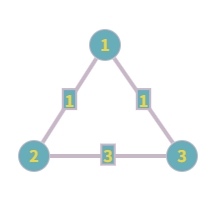
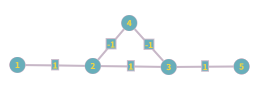
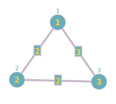

# hw5 刘佳璇 231220105

## 第十章

### 10.3  $MST$ 最小权边问题

1）一定在

​	Kruscal： $e_1$ 一定第一个被选中。

​	MCE：令 $V_1={u}$ ，其中 $u$ 是 $e_1$ 的一个顶点，则 $e_1$ 是切 $V_1,V-V_1$ 的MCE。由定理10.4，命题成立。

2）一定在

​	Kruscal： $e_1$ 第一个被选中后，第二个被选中的一定是 $e_2$ 。

​	MCE：假设 $e_1=(u_1,v_1),\;e_2=(u_2,v_2)$ ，则 $\{u_1,v_1\}\neq\{u_2,v_2\}$ 。假设 $u_2\notin\{u_1,v_1\}$ ，则 $e_2$ 是切 $\{u_2\},\;V-\{u_2\}$ 的MCE。

3）不一定在

​	Kruscal：若 $e_1,e_2,e_3$ 构成环，则会优先选择 $e_1,e_2$ ，不会选择 $e_3$ 。

​	MCE：若 $e_1,e_2,e_3$ 构成环，假设 $e_1=(v_1,v_2),\;e_2=(v_2,v_3),\;e_3=\{v_3,v_1\}$ 。若 $e_3$ 是一个切的CE，则 $e_1$ 或 $e_2$ 必然也是这个切的CE，故 $e_3$ 不是MCE。

### 10.6 比较 $Prim$ 算法和 $Kruscal$ 算法

1. Prim算法：

	- 基于数组实现优先队列：时间复杂度为 $\Omicron(n^2+m)$ 
	- 基于堆实现优先队列：时间复杂度为 $\Omicron((n+m)\log{n})$ 

2. Kruscal算法：

	- 基于UNION和FIND实现并查集：时间复杂度为 $\Omicron(nm)$
	- 基于WEIGHTED-UNION和FIND实现并查集时间复杂度为 $\Omicron(m\log{m})$

	Prim算法适合稠密图，Kruscal算法适合稀疏图。 
	
	

### 10.7 最小生成树问题的变体

1）

​	采用Prim算法的框架，把贪心选择权值最小的边改为选择权值最大的边。

2）

​	求出G的最大生成树 $MaxST$，$F=G-MaxST$ 。

### 10.9 添加点后更新最小生成树

​	 $\Omicron(m+\log(m))$ 。因为需要遍历新的边集，而新的边集大小为 $\Omicron(m+n)=\Omicron(m)$ 。

### 10.10 修改边权后更新最小生成树

1）

​	不需要更新。

2）

​	将 $e$ 添加到 $V'$ ，然后删除 $V'$ 中 $e$ 所在的环上权值最大的边。

3）

​	不需要更新。

4）

​	从 $V'$ 中删除 $e$ ，然后遍历 $V-V'-e$ ，将能连通两个连通分量的权值最小的边添加到 $V'$ 。

### 10.13 包含给定边集的最小生成树

​	采用Prim算法的框架，假设 $S=(V',E')$ 初始将 $V',\;V-V'$ 作为图 $G$ 的切，然后递归添加 $MCE$ 。

### 10.14 边是否在最小生成树中

​	 $\Omicron(n+m)$ 遍历图中所有边，找到图中所有的环，若 $e$ 不在环上，则一定在最小生成树中；反之遍历该环上的所有边，若有比 $e$ 权值更大的边，则 $e$ 在最小生成树中，反之不在。

### 10.15 判断正误

1）错误

​	如果最重边不在环上，则它一定属于最小生成树，否则最小生成树有不可达的点。

2）正确

​	若 $e$ 属于最小生成树，则一定可以用环上不在最小生成树中的边替换它，得到权值和更小的生成树。

3）正确

​	若 $e$ 是唯一的最轻边，则一定在最小生成树上；如果有权值与 $e$ 相同的边 $e'$ ，且某个最小生成树包含 $e'$ 不包含 $e$ ，则 $e$ 和 $e'$ 一定在同一个环上，则可用 $e$ 替换 $e'$ 得到另一棵最小生成树。

4）正确

​	采用Kruscal算法，一定会最先选择 $e$ 。

5）错误

​	如下图， $(2,3)$ 间的边是顶点1，2，3构成的环上的最轻边，但不在最小生成树上。

​		

6）错误

​	如下图，顶点 $2,3$ 间的最短路径是边 $(2,3)$ ，不是最小生成树的一部分。

.png)

7）正确

​	Prim算法只关注边的权值大小，而且每条边只会选中一次，因此负权值的边不会导致选出环路。

### 10.16 平方边权

​	正确。最小生成树可以不关注边的具体权值，只关注边权之间的大小关系。当 $x>0$ 时，$f(x)=x^2$ 的图像是单调的，所以在这种意义下，图 $G$ 和 $G'$ 是等价的。

### 10.21 分治计算MST

​	不正确。

​	如下图，将图 $G$ 分为 $V_1=\{1\},\,V_2=\{2,3\}$ 两个子集，计算出的最小生成树权重和为 $4$ ，但实际最小生成树权重和为 $2$ 。



### 10.23 打井铺水管

1）

​	以房子为顶点，水管为边，铺设水管的代价为边权，构建图 $G$ 。选取打井代价最小的房子打井，采用Kruscal算法得到图 $G$ 的最小生成树作为铺设管道的方案，即为最终方案。

2）

​	采用虚点法：在图 $G$ 中添加一个虚点 $u$ ，它和每个顶点之间都有边，且边权为该顶点的打井代价，得到图 $G'$ 。计算用Kruscal算法计算图 $G'$ 的MST，即为所求。

### 10.25 Dijkstra算法在负边权下的反例

​	如下图，以 $1$ 为源点，计算到 $5$ 的最短路径会无限循环。



### 10.26 Dijkstra最短路径树与最小生成树

​	不一定。如下图，最短路径树是 $(1,2)$ 和 $(1,3)$ ，最小生成树是 $(1,2)$ 和 $(2,3)$ 。



### 10.27 有一条负权边的Dijkstra算法

​	TODO

### 10.31 所有边权加1的变化

1）

​	最小生成树不会变化。采用反证法，假设原先的最小生成树为 $T$ ，包含 $k$ 条边，边权加1得到图 $G'$ 。考虑图 $G'$ 中相应的生成树 $T'$ ，权重为 $w(T)+k$ 。如果不是 $T'$ 不是图 $G'$ 中的最小生成树，而 $T_1'$ 是，那么 $w(T_1')=w(T_1)+k《w(T')$ ，而在图 $G$ 中，一定有 $w(T_1)>w(T)$ ，矛盾！故原命题成立

2）

​	最短路径可能发生变化。如下图，左侧为图 $G$ ，右侧为图 $G'$ ，从源点 $1$ 到点 $4$ 的最短路径分别为两图中的黄色路径。

.png)

### 10.33 推广的最短路径问题

​	假设源点为 $s$ 。采用Dijkstra算法，初始化 $dist[s]=c_s$ ，每次更新顶点 $u$ 的邻居 $v$ 时， $Cost[v]=min(Cost[v],Cost[u]+w(u,v)+c_v)$ 。

### 10.34 仅从 $s$ 发出的负权边

​	能。这种图不会出现更新顶点集导致已经算出最短路径的顶点有更短路径的情况。

### 10.36  $best[u]$

​	采用Dijkstra算法，同时更新 $dist[],\,prev[],\,best[]$ 三个数组。初始化 $best[s]=0$ 。假设从点集中取出点 $u$ ，遍历 $u$ 的邻居 $v$ ，仅当  $dist[u]+w(u,v)<dist[v]$ 时才更新 $dist[v]$ 和 $prev[v]$ ，且同时更新 $best[v]=best[u]+1$ 。

### 10.38 高速公路加油

1）

​	删除所有 $l_e>L$ 的边后，采用DFS算法 $\Omicron(n+m)$ 寻找可行路径。

2）

​	采用Dijkstra算法，但是 $dist[u]$ 记录的不是最短路径的权值和，而是当前路径中最长的边。即更新 $u$ 的邻居 $v$ 的 $dist$ 时， $dist[v]=min(dist[v],max(dist[u]),w(u,v))$ 。  


## 第十一章

### 11.1 换硬币

​	用面值从高到低的硬币依次兑换，并且每次兑换一个面值，兑换的数量尽可能多。

正确性证明：

​	假设贪心解为 $a_0,\dots,a_{n-1}$ ，其中 $a_i$ 表示面值为 $c^i$ 的硬币所需的数量，则 $ S = a_0 \cdot 1 + a_1 \cdot c + a_2 \cdot c^2 + \cdots + a_{n-1} \cdot c^{n-1} $ 。假设有不同于贪心解的最优解 $b_0,\dots,b_{n-1}$ ，那么一定存在 $b_i>a_i$ 。令 $b_i-a_i=x$ ，那么需要 $y=\dfrac{x\cdot c^i}{c^j}=x\cdot c^{i-j}$ 张 $b_j(j<i)$ 用来补齐面值为 $x\cdot c^i$ 的钱。因为 $y>x$ ，所以需要的硬币数量更多了，矛盾！故贪心解为最优解。
### 11.3 公路设置基站

​	从左到右依次设置基站，每一个基站覆盖范围的最左端恰能覆盖一个房子，且覆盖的房子不与上一个基站重叠。

```c
int left = 1;
while (left < n)
{
	set station;
    int nxt_left = left + 1;
    while (x[nxt_left] <= x[left] + 2 * t)
        nxt_left++;
    left = nxt_left;
}
```

正确性证明：

​	一共有 $n$ 所房子。

​	当 $n=1$ 时， 第一个基站设置在 $x_1$ 右边 $t$ 距离的位置，是最优解。

​	假设 $n=k$ 时算法正确，考虑 $n=k+1$ 的情况。第一个基站设置在 $x_1$ 右边 $t$ 距离的位置，能在覆盖 $x_1$ 的同时覆盖尽可能多的房子。剩余未被覆盖的房子数量不大于 $k$ ，根据贪心算法已经能得到最优解，可知贪心算法全局最优。


## 第十二章

### 12.1 Floyd-Warshall算法记录最短路径

1）

​	初始化：
$$
GO[i][j]=
\begin{cases}
j,&\text{if (i, j) has edge}\\[2ex]
-1,&\text{else}
\end{cases}
$$
​	更新路径：
$$
GO[i][j]=GO[i][k]
$$
2）

​	初始化：
$$
GO[i][j]=
\begin{cases}
i,&\text{if (i, j) has edge}\\[2ex]
-1,&\text{else}
\end{cases}
$$
​	更新路径：
$$
GO[i][j]=GO[k][j]
$$

### 12.2 输油管道网络

1）

​	采用Dijkstra算法，更新 $u$ 的邻居 $v$ 的 $cap(s,v)$ ：
$$
cap(s,v)=max\{cap(s,v),\,min(cap(s,u),c(u,v)\}
$$
2）

​	采用Floyd-Wallshall算法，更新 $D^k_{ij}$ ：
$$
D^k_{ij}=max\{D^{k-1}_{ij},\,min(D^{k-1}_{ik},\,D^{k-1}_{kj})\}
$$
​	最终得到 $cap(u,v)=D^n_{uv}$ 。

### 12.4 两个点集间的最短路径

​	添加虚点 $s$ 和 $t$ ，其中 $s$ 与 $S$ 中的所有顶点相连，且边权均为 $0$ ， $t$ 与 $T$ 中的所有顶点相连，且边权均为 $0$ 。以 $s$ 为源点进行Dijkstra算法即可。

### 12.7 经过顶点 $v_0$ 的最短路径

​	以 $v_0$ 为源点分别对图 $G$ 和转置后的图 $G'$ 进行Dijkstra算法，求 $(u,v)$ 间的最短路径只需将图 $G'$ 中 $(v_0,u)$ 间最短路径的转置与图 $G$ 中 $(v_0,v)$ 间最短路径拼接起来。