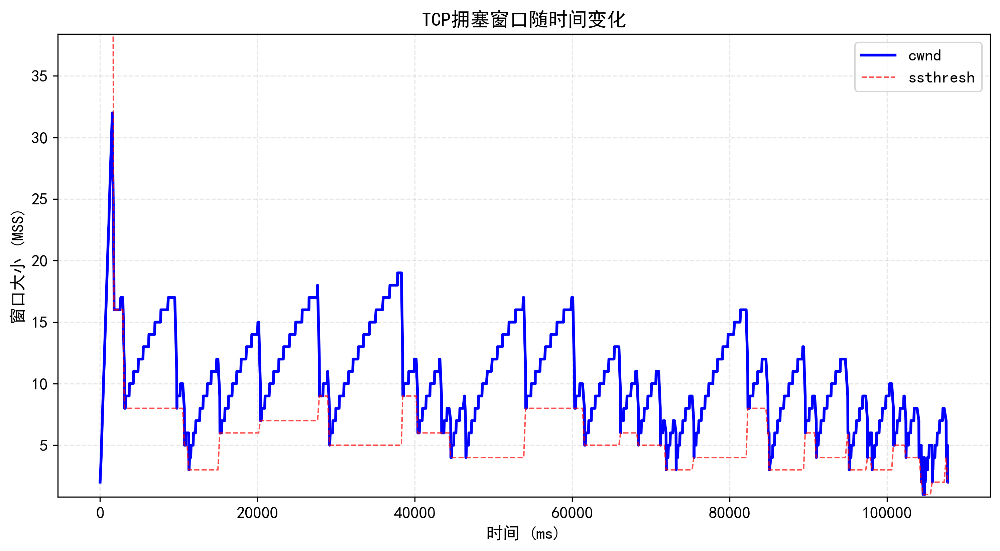

# 拥塞控制实验报告 23122105 刘佳璇


## 设计思路

本实验采用拥塞控制算法，核心思想是通过维护一个状态机，根据收到的ACK包和超时信息动态调整拥塞窗口（cwnd）和慢启动门限（ssthresh）。主要分为三个阶段（与课本中给出的状态机一致）：

- **慢启动（SLOW_START）**：cwnd指数增长，直到达到ssthresh。
- **拥塞避免（AVOID_CONGESTION）**：cwnd线性增长。
- **快速恢复（FAST_RECOVERY）**：处理丢包和重复ACK，快速恢复丢失的数据。


## 代码设计

### 1. 相关变量在结构体中的定义

```c
include/tcp_sock.h
    
struct tcp_sock
{
    ...
    u32 cwnd;      // 拥塞窗口
    u32 ssthresh;  // 慢启动门限
    int dup_ack_cnt; // 重复ACK计数器
    int c_state;     // 拥塞控制状态
    u32 recovery_point; // 快速恢复结束点
    ...
};
```

### 2. 相关函数实现

#### 1. 拥塞控制主函数

```c
/*
 * 拥塞控制主函数，根据当前TCP拥塞控制阶段(tsk->c_state)和收到的ACK包信息(cb->ack和ack_valid)，
 * 更新拥塞窗口cwnd、慢启动阈值ssthresh等参数。
 * 通过状态机的方式处理不同的拥塞控制阶段：SLOW_START、AVOID_CONGESTION、FAST_RECOVERY。
 */
void tcp_congestion_control(struct tcp_sock *tsk, struct tcp_cb *cb, char *packet)
{
    // 保存旧状态以便检测状态变化
    int old_state = tsk->c_state;

    // 只处理ACK包
    if (!(cb->flags & TCP_ACK))
        return;

    // 判断是新的ACK还是重复ACK
    int is_new_ack = greater_than_32b(cb->ack, tsk->snd_una);
    int is_dup_ack = (cb->flags & TCP_ACK) && (cb->ack == tsk->snd_una);

    log(DEBUG, "拥塞控制状态: %s, cwnd: %u, ssthresh: %u",
        tsk->c_state == TCP_SLOW_START ? "慢启动" : (tsk->c_state == TCP_CONGESTION_AVOIDANCE ? "拥塞避免" : "快速恢复"),
        tsk->cwnd, tsk->ssthresh);

    switch (tsk->c_state)
    {
    case TCP_SLOW_START:
        if (is_new_ack)
        {
            // 慢启动阶段，每收到一个ACK，cwnd增加一个MSS
            tsk->cwnd += TCP_MSS;
            log(DEBUG, "慢启动: cwnd增加到 %u", tsk->cwnd);
            log_tcp_event(tsk, "receive ack in TCP_RENO_SLOW_START");

            // 如果cwnd超过阈值，进入拥塞避免状态
            if (tsk->cwnd >= tsk->ssthresh)
            {
                tsk->c_state = TCP_CONGESTION_AVOIDANCE;
                log(DEBUG, "进入拥塞避免状态");
                log_tcp_event(tsk, "receive ack in TCP_RENO_CONGESTION_AVOIDANCE");
            }
        }
        else if (is_dup_ack)
        {
            // 收到重复ACK，计数增加
            tsk->dup_ack_cnt++;

            // 如果收到3个重复ACK，进入快速恢复状态
            if (tsk->dup_ack_cnt >= 3)
            {
                // 快速重传
                tcp_retrans_send_buffer(tsk);

                // 设置新的阈值和cwnd
                tsk->ssthresh = tsk->cwnd / 2;
                tsk->cwnd = tsk->ssthresh + 3 * TCP_MSS;

                tsk->dup_ack_cnt = 0;

                // 设置恢复点
                tsk->recovery_point = tsk->snd_nxt;
                
                tsk->c_state = TCP_FAST_RECOVERY;
                log(DEBUG, "进入快速恢复状态: cwnd=%u, ssthresh=%u", tsk->cwnd, tsk->ssthresh);
                log_tcp_event(tsk, "TCP_CONGESTION into FAST_RECOVERY");
            }
        }
        break;

    case TCP_CONGESTION_AVOIDANCE:
        if (is_new_ack)
        {
            // 拥塞避免阶段，cwnd每个RTT增加1个MSS
            // 近似实现为每收到cwnd个字节确认，cwnd增加1个MSS
            tsk->cwnd += (TCP_MSS * TCP_MSS) / tsk->cwnd;
            log(DEBUG, "拥塞避免: cwnd增加到 %u", tsk->cwnd);
            log_tcp_event(tsk, "receive ack in TCP_RENO_CONGESTION_AVOIDANCE");
        }
        else if (is_dup_ack)
        {
            tsk->dup_ack_cnt++;

            // 3个重复ACK，进入快速恢复
            if (tsk->dup_ack_cnt >= 3)
            {
                tcp_retrans_send_buffer(tsk);

                tsk->ssthresh = tsk->cwnd / 2;
                tsk->cwnd = tsk->ssthresh + 3 * TCP_MSS;
                tsk->dup_ack_cnt = 0;
                tsk->recovery_point = tsk->snd_nxt;

                tsk->c_state = TCP_FAST_RECOVERY;
                log(DEBUG, "进入快速恢复状态: cwnd=%u, ssthresh=%u", tsk->cwnd, tsk->ssthresh);
                log_tcp_event(tsk, "TCP_CONGESTION into FAST_RECOVERY");
            }
        }
        break;

    case TCP_FAST_RECOVERY:
        if (is_new_ack && greater_or_equal_32b(cb->ack, tsk->recovery_point))
        {
            // 收到恢复点后的ACK，退出快速恢复
            tsk->cwnd = tsk->ssthresh;
            tsk->dup_ack_cnt = 0;
            tsk->c_state = TCP_CONGESTION_AVOIDANCE;
            log(DEBUG, "退出快速恢复: cwnd=%u, ssthresh=%u", tsk->cwnd, tsk->ssthresh);
            log_tcp_event(tsk, "cwnd >= recovery_point, change to TCP_RENO_CONGESTION_AVOIDANCE");
        }
        else if (is_new_ack)
        {
            // 收到新ACK但未到恢复点，部分确认
            tsk->cwnd += TCP_MSS;
            log_tcp_event(tsk, "receive ack in TCP_RENO_QUICK_RECOVERY");
        }
        else if (is_dup_ack)
        {
            // 快速恢复阶段收到重复ACK，增加cwnd
            tsk->cwnd += TCP_MSS;
            tsk->dup_ack_cnt++;

            if (tsk->dup_ack_cnt >= 3)
            {
                tcp_retrans_send_buffer(tsk);

                tsk->ssthresh = tsk->cwnd / 2;
                tsk->cwnd = tsk->ssthresh + 3 * TCP_MSS;
                tsk->dup_ack_cnt = 0;
                tsk->recovery_point = tsk->snd_nxt;

                log(DEBUG, "进入快速恢复状态: cwnd=%u, ssthresh=%u", tsk->cwnd, tsk->ssthresh);
                log_tcp_event(tsk, "TCP_CONGESTION into FAST_RECOVERY");
            }
            else
            {
                log_tcp_event(tsk, "receive duplicate ack in TCP_RENO_FAST_RECOVERY");
            }

            log(DEBUG, "快速恢复中收到重复ACK: cwnd=%u", tsk->cwnd);
        }
        break;
    }

    // 记录常规ACK事件
    if (old_state == tsk->c_state && is_new_ack &&
        tsk->c_state != TCP_QUICK_RECOVERY)
    {
        log_tcp_event(tsk, "receive ack in TCP_RENO_");
    }
}
```

#### 功能

- 慢启动阶段：每收到一个新的ACK，cwnd增加一个MSS，指数增长，直到达到ssthresh。
- 拥塞避免阶段：每收到一个新的ACK，cwnd线性增长。
- 快速恢复阶段：收到3个重复ACK后，快速重传丢失的数据，调整cwnd和ssthresh，进入快速恢复状态，直到收到新的ACK。

#### 2. 拥塞窗口接入

```c
static inline void tcp_update_window(struct tcp_sock* tsk, struct tcp_cb* cb)
{
    ...  
	// 在每次发送数据包时，发送窗口由流量控制窗口和拥塞窗口共同决定
    tsk->snd_wnd = min(tsk->adv_wnd,tsk->cwnd);
    ...
}
```

#### 功能

- 发送窗口由流量控制和拥塞控制共同决定，取两者较小值，保证既不超过对端接收能力，也不超过网络拥塞能力。

#### 3. 拥塞窗口定时记录

```c
/*
 * 拥塞窗口记录线程函数
 * 进入ESTABLISHED状态时创建线程，定期记录当前时间、cwnd、ssthresh和adv_wnd到cwnd.txt文件
 */
void *tcp_cwnd_thread(void *arg)
{
    struct tcp_sock *tsk = (struct tcp_sock *)arg;
    FILE *fp = fopen("cwnd.txt", "w");
    if (!fp)
    {
        log(ERROR, "无法创建cwnd.txt文件");
        return NULL;
    }

    int time_us = 0;
    while (tsk->state == TCP_ESTABLISHED && time_us < 1000000)
    {
        usleep(500); // 每500us记录一次
        time_us += 500;
        fprintf(fp, "%d %f %u %u\n", time_us, (float)tsk->cwnd, tsk->ssthresh, tsk->adv_wnd);
    }

    fclose(fp);
    return NULL;
}
```

#### 功能

- 该线程定期记录拥塞窗口的变化，便于后续分析TCP拥塞控制的动态过程。


## 实验结果




## 结果分析

以第一个拥塞控制状态循环为例：

#### 1. 慢启动阶段

- **时间范围**: 0ms - 1555ms
- **cwnd**: 从2 MSS指数增长到32 MSS
- **机制**: 每收到一个ACK，cwnd增加1 MSS
- **变化趋势**: cwnd快速上升，近似指数增长曲线
- **结束条件**: 未达到ssthresh(64 MSS)就发生了丢包

#### 2. 快速恢复阶段

- **时间范围**: 1759ms - 1780ms
- **cwnd**: 从19 MSS降至16 MSS
- **开始条件**: 检测到3个重复ACK，表明网络发生拥塞但不是超时
- **机制:**
  - ssthresh设置为cwnd的一半 = 16 MSS
  - cwnd设置为19 MSS (ssthresh + 3 MSS)
  - 重传丢失的数据包
- **变化趋势**: cwnd有明显下降，但并未降至1
- **结束条件**: 收到新的ACK，将cwnd设置为ssthresh值(16 MSS)，进入拥塞避免阶段

#### 3. 拥塞避免阶段

- **时间范围**: 1780ms - 3093ms
- **cwnd**: 线性增长，从16 MSS逐渐增加
- **机制**: 每个RTT，cwnd增加1 MSS（相当于每个ACK，cwnd增加1/cwnd）
- **变化趋势**: 增长速率明显比慢启动阶段慢，呈现线性增长
- **结束条件**: 在时间3093ms处再次检测到重复ACK，进入下一轮快速恢复

