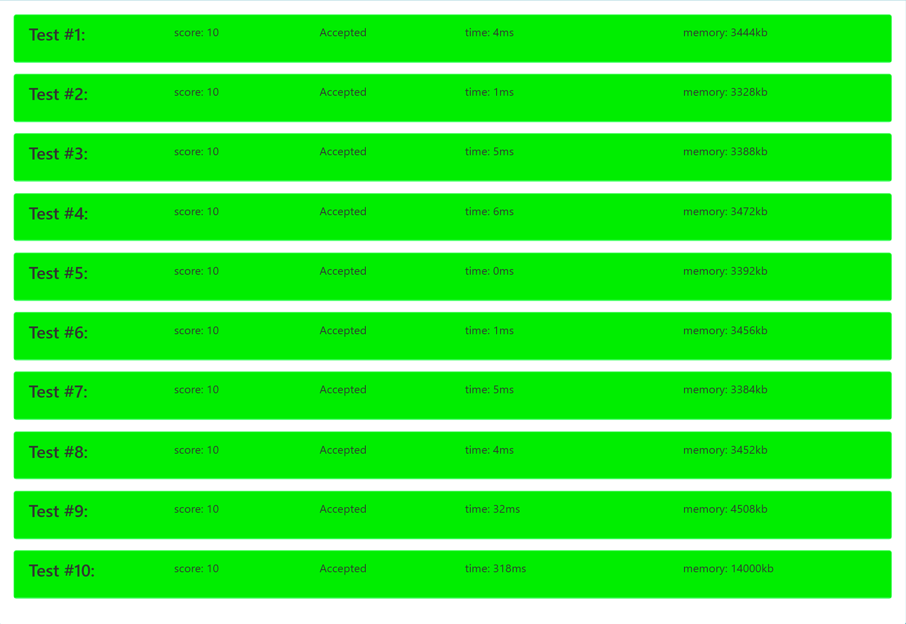

# 2024-2025《数据结构》大作业报告

#### **学号：<u>231220105</u>**

### **姓名：<u>刘笑妤</u>**

### **院系：<u>计算机学院计算机科学与技术系</u>** 


## **一、第一题 **魔法解谜

1. 解题思路：

- 使用数组存储的二叉树表示蜡烛阵，二叉树节点`TreeNode`表示蜡烛。

```c++
struct TreeNode
{
	bool out;	//表示蜡烛亮灭状态：灭 true，亮false
	int left;	//指向该节点的左子树
	int right;	//指向该节点的右子树

	TreeNode() :out(false), left(-1), right(-1) {}
};

class Tree
{
public:
	Tree();
	void solution();

private:
	TreeNode* treeList;	//数组存储二叉树，数组下标即为节点编号
	int n, m;	// n 表示蜡烛阵的蜡烛数量， m 表示集合 S 的大小
	int cnt;	//存储翻转操作的次数

	void reverse(int i);	//翻转操作：将蜡烛节点 i 及其子树中所有蜡烛节点的亮灭状态翻转
	void check(int i);	//从节点 i 开始依次向后检查蜡烛节点
};
```

- 从根开始依次遍历各节点，遇到熄灭的蜡烛就点亮。

```c++
int main()
{
	Tree tree;
	tree.solution();

	return 0;
}

void Tree::solution()
{
	cnt = 0;

	check(1);
	cout << cnt;
}
```

- 时间复杂度分析
  - 构建树的过程需要$O(n)$时间，设置蜡烛初始状态需要$O(m)$时间；
  - 对任意节点`i`进行`reverse()`操作所需要的最坏时间复杂度为$O(n)$；
  - 进行`check()`操作的最坏情况需要进行$O(n)$次`reverse()`操作；
  - 所以总的时间复杂度在最坏情况下为$O(n^2)$。


2. 核心代码+注释：

```c++
void Tree::reverse(int i)	//翻转操作：将蜡烛节点 i 及其子树中所有蜡烛节点的亮灭状态翻转
{
	if (i == -1)	//若节点为空，则结束递归；否则按前序排序进行递归

		return;

	treeList[i].out = !treeList[i].out;	//改变当前节点的亮灭状态
	//依次对左右子树递归进行翻转操作
	reverse(treeList[i].left);
	reverse(treeList[i].right);
}

void Tree::check(int i)	//从节点 i 开始依次向后检查蜡烛节点
{
	if (i == -1)	//若节点为空，则结束递归；否则按前序排序进行递归
		return;

	if (treeList[i].out)	//若当前节点状态为灭，翻转该节点并计数加 1
	{
		cnt++;
		reverse(i);
	}
	// 依次对左右子树递归进行检查
	check(treeList[i].left);
	check(treeList[i].right);
}
```


3. OJ运行结果截图



 

## **二、第二题** 小蓝鲸的战斗力

1. 解题思路：

- 使用数组存储的最大堆`MaxHeap`记录战斗结果

  ```c++
  const int DefaultSize = 128;
  
  class MaxHeap
  {
  public:
  	MaxHeap(int sz = DefaultSize);
  	MaxHeap(int arr[], int n);
  	~MaxHeap() { delete[]heap; }
  
  	int size() { return currentSize; }
  	int top() { return heap[0]; }
  	bool push(int& x);
  	bool pop();
  	bool pop(int& x);
  	bool empty() const { return currentSize == 0; }
  	bool full() const { return currentSize == maxHeapSize; }
  	void clear() { currentSize = 0; }
  
  private:
  	int* heap;
  	int currentSize;
  	int maxHeapSize;
  	void siftDown(int start, int m);
  	void siftUp(int start);
  
  };
  
  ```

- 时间复杂度分析

  - 读取输入数据的时间复杂度为$O(n+q)$
  - 初始化堆`heap_1` 和 `heap_2`的时间复杂度为$O(n+r)$
  - 将新战斗结果插入 `heap_1`的总时间为$O(\log n)$，
  - 对每个检查点进行检查时，
    $$ \text{top\_index} = \left\lceil \frac{\text{check\_points}[i]}{m} \right\rceil $$
    将最近的 `r` 个战斗结果插入 `heap_2`的时间为$O(r\log r)$，从 `heap_2` 中弹出 `k` 个最大值并累加的时间为$O(k\log r)$，将弹出的 `top_index` 个元素重新插入 `heap_1`的时间为$O(top_indexlog⁡n)$
  - 对每次查询，时间复杂度近似为$$ O\left( \frac{n}{m} \cdot \log n + (r + k) \cdot \log r \right) \ $$，所以`q`次查询的总的时间复杂度为$$ O\left( q \cdot \left( \frac{n}{m} \cdot \log n + (r + k) \cdot \log r \right) \right) $$。
  - 总的时间复杂度为$$ O\left( n \cdot \log n + q \cdot \left( \frac{n}{m} \cdot \log n + (r + k) \cdot \log r \right) \right) $$


2. 核心代码+注释：

```c++
int main()
{
	// n 代表战斗总次数
	// 已经过 N 次战斗时，最高的 (N / m)取上整 个战斗结果中最低的战斗结果为 x，
	//					  最近的 r 个战斗结果中最高的 k 个战斗结果为 y[1], ... , y[k] (不足 r 个用 0 补齐)
	// 当前战斗力为 x * k + ∑y
	// 输出 q 次即时查询的结果

	//初始化
	int n, m, r, k, q;
	cin >> n >> m >> r >> k >> q;

	int* combat_results = new int[n + 1];	//存储所有战斗的结果
	combat_results[0] = 0;
	for (int i = 1; i <= n; i++)
		cin >> combat_results[i];

	int* check_points = new int[q + 1];		//存储查询的时刻
	check_points[0] = 0;
	for (int i = 1; i <= q; i++)
		cin >> check_points[i];

	MaxHeap heap_1(n);	//用于计算位于查询点时最高的 (N / m)取上整 个战斗结果
	MaxHeap heap_2(r);	//用于计算最近的 r 个战斗结果中最高的 k 个战斗结果

	for (int i = 1; i <= q; i++)
	{
		heap_2.clear();

		int top_index = (check_points[i] + m - 1) / m;
		int x, y = 0;
		int* poped_x = new int[top_index];

		// 求 x
		for (int j = check_points[i - 1] + 1; j <= check_points[i]; j++)
			heap_1.push(combat_results[j]);
		// 保存被 pop 的战斗结果
		for (int j = 0; j < top_index; j++)
		{
			heap_1.pop(x);
			poped_x[j] = x;
		}

		// 求 y[1] ... y[k]
		for (int j = 0; j < r; j++)
		{
			int index = check_points[i] - j;
			if (index <= 0)
				break;

			heap_2.push(combat_results[index]);
		}

		for (int j = 0; j < min(k, check_points[i]); j++)
		{
			y += heap_2.top();
			heap_2.pop();
		}

		// 打印当前检查点的结果
		cout << x * k + y << ' ';

		// 恢复堆，将计算 x 时被 pop 的战斗结果 push 回 heap_1
		for (int j = 0; j < top_index; j++)
			heap_1.push(poped_x[j]);
	}

	return 0;
}
```

 

3. OJ运行结果截图


## **三、第三题  小蓝鲸学传送**

1. 解题思路：

- 使用邻接表存储的图记录小岛、绳索和传送门

```c++
struct edge
{
	int dest;
	int cost;
	edge* link;

	edge(int d, int c, edge* l = nullptr) :dest(d), cost(c), link(l) {};
};

struct vertex
{
	edge* adj;

	vertex(edge* a = nullptr) :adj(a) {};
};

class graph
{
public:
	graph();

	int getWeight(int u, int v);
	void solution();

private:
	int n, m, s, t, q;
	vertex* web;	//邻接表
	vertex* rweb;	//转置邻接表
	int* dist;		//记录从起点 s 到各顶点的最短路径
	int* rdist;		//记录从各顶点到终点 t 的最短路径

	void dijkstra(int v);	//计算 dist 数组
	void r_dijkstra(int v);	//计算 rdist 数组
};
```

-   使用数组存储的最小堆`MinHeap`以及结构体`HeapNode`辅助实现Dijkstra算法

```c++
const int DefaultSize = 128;

template<class T>
class MinHeap
{
public:
	MinHeap(int sz = DefaultSize);
	MinHeap(T arr[], int n);
	~MinHeap() { delete[]heap; }
	T top() { return heap[0]; }
	bool push(T& x);
	bool pop();
	bool pop(T& x);
	bool empty() const { return curSize == 0; }
	bool full() const { return curSize == maxHeapSize; }
	void clear() { curSize = 0; }

private:
	T* heap;
	int curSize;
	int maxHeapSize;
	void siftDown(int start, int m);
	void siftUp(int start);

};

//最小堆的节点，成员为小岛编号和当前最短距离
struct HeapNode {
	int vertex;
	int distance;

	HeapNode(int v = 0, int d = 0) : vertex(v), distance(d) {};

	bool operator<(const HeapNode& h) const
	{
		return distance < h.distance;
	}	
	
	bool operator<=(const HeapNode& h) const
	{
		return distance <= h.distance;
	}

	bool operator>(const HeapNode& h) const 
	{
		return distance > h.distance;
	}

	bool operator>=(const HeapNode& h) const
	{
		return distance >= h.distance;
	}
};
```

- 时间复杂度分析
  - 初始化图的时间复杂度为$O(m)$
  - Dijkstra算法最多进行$O(m)$次插入操作，$O(n)$次删除操作，每次操作的时间复杂度为$O(\log n)$，总的时间复杂度为$O((n + m)\log n)$
  - `q`次查询的时间复杂度为$O(q)$
  - 总的时间复杂度为$O((n + m)\log n + q)$


2. 核心代码+注释：

```c++
void graph::solution()
{
	//计算从起点 s 到所有顶点的最短距离
	dijkstra(s);
	// 计算从终点 t 到所有顶点的反向最短距离
	r_dijkstra(t);

	cin >> q;
	for (int i = 0; i < q; i++)
	{
		int u, v, w;
		cin >> u >> v >> w;

		//初始答案为当前从 s 到 t 的最短距离
		int ans = dist[t];

		//检查是否存在从 s 到 u 的路径和从 v 到 t 的路径，并且检查添加边 u->v 后的路径长度是否更短
		if (dist[u] < MAX && rdist[v] < MAX && dist[u] + w + rdist[v] < ans)
			ans = dist[u] + w + rdist[v];

		//输出结果，如果无法到达则输出 -1，否则输出最短路径长度
		if (ans == MAX)
			cout << "- 1\n";
		else
			cout << ans << "\n";
	}
}

void graph::dijkstra(int v)
{
	fill(dist, dist + n + 1, MAX);
	dist[v] = 0;

	MinHeap<HeapNode> heap(n * 2);
	HeapNode h(v, 0);
	heap.push(h);

	while (!heap.empty()) 
	{
		HeapNode cur = heap.top();	//使用最小堆选择当前距离最小的顶点
		heap.pop();

		int u = cur.vertex;
		int cur_dist = cur.distance;

		//遍历该顶点的所有邻接边，更新相邻顶点的最短距离，并将更新后的顶点重新插入堆中
		edge* e = web[u].adj;
		while (e) 
		{
			int v = e->dest;
			int w = e->cost;
			if (dist[u] < MAX && dist[u] + w < dist[v])
			{
				dist[v] = dist[u] + w;
				HeapNode node(v, dist[v]);
				heap.push(node);
			}
			e = e->link;
		}
	}
}

void r_dijkstra(int v)	//使用转置邻接表 rweb 计算数组 rdist，与 dijkstra(int v) 函数的实现相仿
```

 

3. OJ运行结果截图


## **四、第四题 最终挑战**

1. 解题思路：

- 使用邻接表存储的图记录小岛、绳索和传送门

```c++
struct EtherDrops {
    int index;
    int num;
    int demon;

    EtherDrops(int i = 0, int n = 0, int d = 0) : index(i), num(n), demon(d) {};
};

struct edge {
    int dest;
    int cost;
    edge* link;

    edge(int d, int c, edge* l = nullptr) : dest(d), cost(c), link(l) {};
};

struct vertex {
    edge* adj;

    vertex(edge* a = nullptr) : adj(a) {};
};

class graph {
public:
    graph(int n, int m);
    int getWeight(int u, int v);
    void solution();

private:
    int n, m, s, t, x0, p;
    vertex* web;
    EtherDrops* etherInfo;
    int** a;
    int* important;
    int* dist;
    int* parent;
    bool* visited;
    int path[MAX_PATH_SIZE];  // 存储路径的数组
    int pathIndex;  // 路径的当前索引

    void floyd();
    void dfs(int v, int prev, int totalCost, int currentPower);
    int fightTime(int x, int y) {
        return max(100 - (x - y), 0);
    }
};

```

-   使用数组存储的最小堆`MinHeap`以及结构体`HeapNode`辅助实现Dijkstra算法

```c++
const int DefaultSize = 128;

template<class T>
class MinHeap
{
public:
	MinHeap(int sz = DefaultSize);
	MinHeap(T arr[], int n);
	~MinHeap() { delete[]heap; }
	T top() { return heap[0]; }
	bool push(T& x);
	bool pop();
	bool pop(T& x);template<class T>
class MinHeap {
public:
    MinHeap(int sz = DefaultSize);
    MinHeap(T arr[], int n);
    ~MinHeap() { delete[] heap; }
    T top() { return heap[0]; }
    bool push(T& x);
    bool pop();
    bool pop(T& x);
    bool empty() const { return curSize == 0; }
    bool full() const { return curSize == maxHeapSize; }
    void clear() { curSize = 0; }

private:
    T* heap;
    int curSize;
    int maxHeapSize;
    void siftDown(int start, int m);
    void siftUp(int start);
};

struct HeapNode {
    int vertex;
    int distance;

    HeapNode(int v = 0, int d = 0) : vertex(v), distance(d) {};

    bool operator<(const HeapNode& h) const {
        return distance < h.distance;
    }

    bool operator<=(const HeapNode& h) const {
        return distance <= h.distance;
    }

    bool operator>(const HeapNode& h) const {
        return distance > h.distance;
    }

    bool operator>=(const HeapNode& h) const {
        return distance >= h.distance;
    }
};
	bool empty() const { return curSize == 0; }
	bool full() const { return curSize == maxHeapSize; }
	void clear() { curSize = 0; }

private:
	T* heap;
	int curSize;
	int maxHeapSize;
	void siftDown(int start, int m);
	void siftUp(int start);

};

//最小堆的节点，成员为小岛编号和当前最短距离
struct HeapNode {
	int vertex;
	int distance;

	HeapNode(int v = 0, int d = 0) : vertex(v), distance(d) {};

	bool operator<(const HeapNode& h) const
	{
		return distance < h.distance;
	}	
	
	bool operator<=(const HeapNode& h) const
	{
		return distance <= h.distance;
	}

	bool operator>(const HeapNode& h) const 
	{
		return distance > h.distance;
	}

	bool operator>=(const HeapNode& h) const
	{
		return distance >= h.distance;
	}
};
```

- 时间复杂度分析
  - 初始化图和相关数据结构的总时间复杂度是$O(n^2 + m + q)$
  - Floyd算法的时间复杂度是$O(n^3)$
  - dfs算法最坏情况下每个节点会被访问一次，且每条边会被访问一次，时间复杂度是$O(n+m)$
  - 程序的总体时间复杂度为$O(n^3 + n^2 + m + q)$，可简化为$O(n^3)$


2. 核心代码+注释：

```c++
void graph::solution() {
    cin >> s >> t;
    cin >> x0 >> p;

    important = new int[p + 2];
    important[p] = s;
    important[p + 1] = t;

    etherInfo = new EtherDrops[p];
    for (int i = 0; i < p; ++i) {
        int idx, num, demon;
        cin >> idx >> num >> demon;
        etherInfo[i] = EtherDrops(idx, num, demon);

        important[i] = idx;
    }

    for (int i = 0; i < m; ++i) {
        int u, v, w;
        cin >> u >> v >> w;
        web[u].adj = new edge(v, w, web[u].adj);
    }

    floyd();
    dist[s] = 0;
    dfs(s, -1, 0, x0);

    if (dist[t] == MAX) {
        cout << -1 << endl;
        return;
    }
    else {
        // 输出最短路径
        int node = t;
        pathIndex = 0;  // 重置路径索引
        while (node != -1) {
            path[pathIndex++] = node;
            node = parent[node];
        }

        for (int i = pathIndex - 1; i >= 0; --i) {
            cout << path[i] << " ";
        }
        cout << endl;
        cout << dist[t] << endl;
    }
}

void graph::floyd()
{
    for (int k = 1; k <= n; k++)
        for (int i = 1; i <= n; i++)
            for (int j = 1; j <= n; j++)
                if (a[i][k] < MAX && a[k][j] < MAX && a[i][k] + a[k][j] < a[i][j])
                    a[i][j] = a[i][k] + a[k][j];
}

void graph::dfs(int v, int prev, int totalCost, int currentPower) {
    visited[v] = true;

    if (v == t) {
        if (totalCost < dist[t]) {
            dist[t] = totalCost;
            parent[t] = prev;
        }
        visited[v] = false;
        return;
    }

    for (edge* e = web[v].adj; e != nullptr; e = e->link) {
        int next = e->dest;
        int newCost = totalCost + e->cost;

        if (visited[next]) continue;

        // 更新战斗力
        int newPower = currentPower;
        for (int i = 0; i < p; ++i) {
            if (etherInfo[i].index == next) {
                newPower += etherInfo[i].num;
                break;
            }
        }

        // 计算战斗时间
        int fightTimeCost = fightTime(currentPower, etherInfo[v].demon);
        newCost += fightTimeCost;

        if (newCost < dist[next]) {
            dist[next] = newCost;
            parent[next] = v;
            dfs(next, v, newCost, newPower);
        }
    }

    visited[v] = false;
}
```

 

3. OJ运行结果截图


