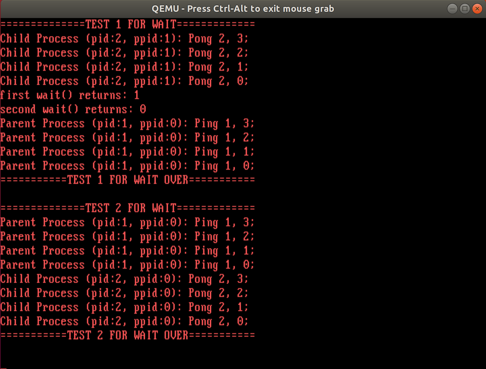

# lab3 实验报告

姓名：刘佳璇

学号：231220105

邮箱：13573529579@163.com

## 实验进度

我完成了所有内容，包括选做wait。

## 实验结果

## 实验修改的代码位置

1. lib/lib.h：添加定义
   - #define SYS_GETPPID 6
   - #define SYS_WAIT 7
   - pid_t getppid();
   - int wait();

2. lib/syscall.c：添加函数实现
   - pid_t fork()
   - int sleep(uint32_t time)
   - int exit()
   - pid_t getpid()
   - pid_t getppid()
   - int wait()
3. kernel/kernel/irqHandle.c：添加函数实现

   - void timerHandle(struct StackFrame *sf);
   - void syscallHandle(struct StackFrame *sf);
   - void sysFork(struct StackFrame *sf);
   - void sysExec(struct StackFrame *sf);
   - void sysSleep(struct StackFrame *sf);
   - void sysExit(struct StackFrame *sf);
   - void sysGetPid(struct StackFrame *sf);
   - void sysGetPpid(struct StackFrame *sf);
   - void sysWait(struct StackFrame *sf);
   - uint32_t schedule();
   - void contextSwitch(int nxt); // 上下文切换
