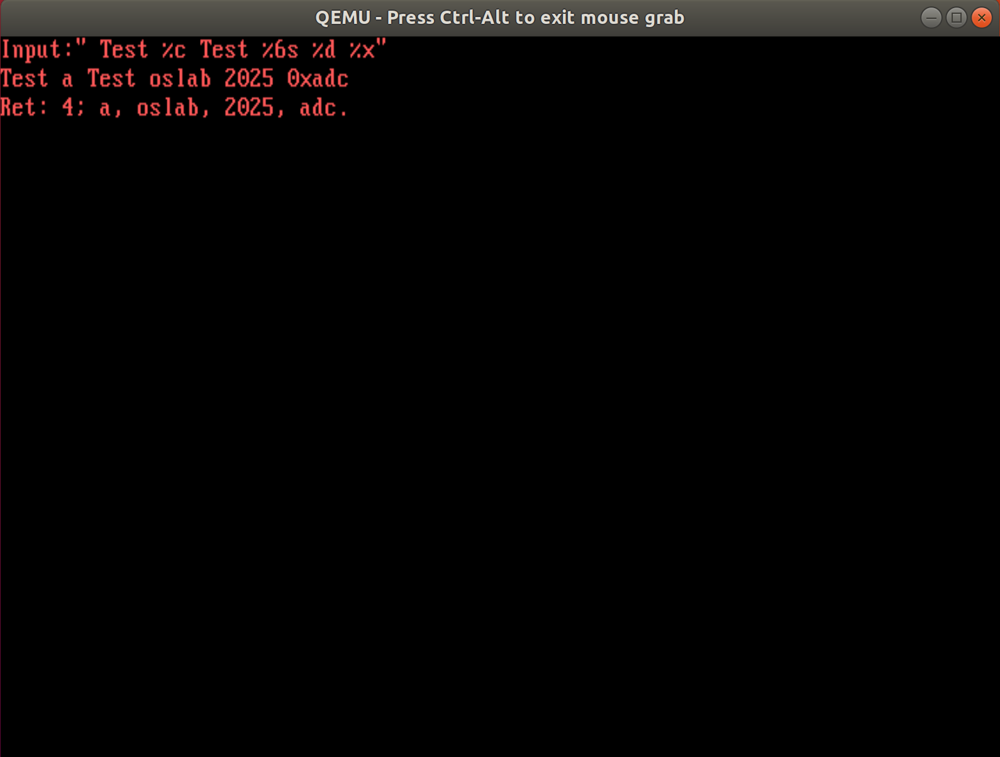
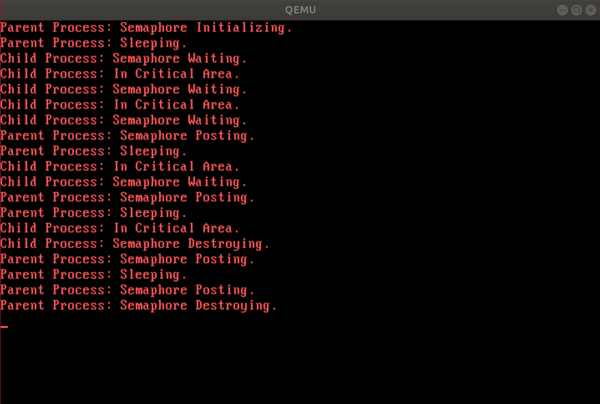
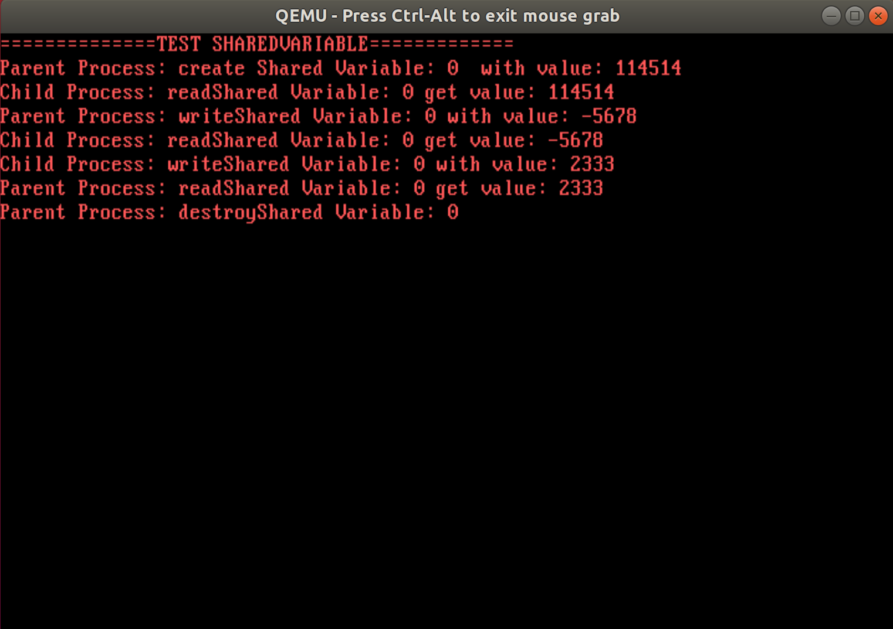
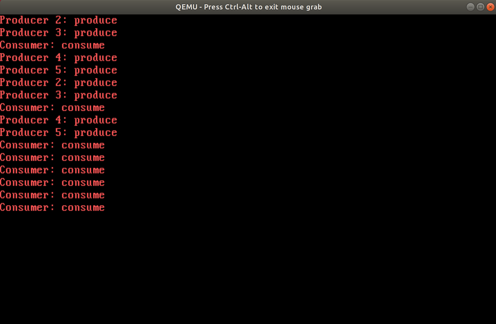

# lab4 实验报告

姓名：刘佳璇

学号：231220105

邮箱：13573529579@163.com

## 实验进度

我完成了lab 4.1，lab 4.2，lab 4.3，lab 4.4，其中lab 4.4实现了生产者-消费者问题。

## 实验结果

## 实验修改的代码位置

**lab 4.1**

1. kernel/kernel/irqHandle.c：

   - void sysReadStdIn(struct StackFrame *sf); // 添加函数实现
   - void keyboardHandle(struct StackFrame *sf); // 添加键盘按键的串口回显和控制进程同步的代码

**lab 4.2**

1. kernel/kernel/irqHandle.c：添加函数实现
   - void sysSemInit(struct StackFrame *sf);
   - void sysSemWait(struct StackFrame *sf);
   - void sysSemPost(struct StackFrame *sf);
   - void sysSemDestroy(struct StackFrame *sf);

**lab 4.3**

1. kernel/kernel/irqHandle.c：添加函数实现
   - void sysSVarCreate(struct StackFrame *sf);
   - void sysSVarDestroy(struct StackFrame *sf);
   - void sysSVarRead(struct StackFrame *sf);
   - void sysSVarWrite(struct StackFrame *sf);
2. lib/syscall.c：添加函数实现
   - int createSharedVariable(sharedvar_t *svar, int value);
   - int destroySharedVariable(sharedvar_t *svar);
   - int readSharedVariable(sharedvar_t *svar);
   - int writeSharedVariable(sharedvar_t *svar, int value);
3. kernel/kernel/kvm.c：添加函数实现
   - initSharedVariable(void);

**lab 4.4**

1. lib/lib.h
   - 添加宏定义 `#define SYS_GETPID 6`，并修改原有的宏定义 `#define SYS_SEM 7` 和 `#define SYS_SHAREDVAR 8` 
   - pid_t getpid(); // 添加函数定义
2. lib/syscall.c
   - pid_t getpid(); // 添加函数实现
3. kernel/kernel/irqHandle.c
   - 添加宏定义 `#define SYS_GETPID 6`，并修改原有的宏定义 `#define SYS_SEM 7` 和 `#define SYS_SHAREDVAR 8` 
   - void syscallHandle(struct StackFrame *sf); // 添加 case SYS_GETPID
   - void sysGetPid(struct StackFrame *sf); // 添加函数定义和实现
4. app/main.c
   - 添加宏定义 
     - int item[N] = {}
   - 添加全局变量
     - sem_t full;
     - sem_t empty;
     - sem_t mutex;
     - int in = 0;
     - int out = 0;
     - int id;
   - void produce(); // 添加定义和实现
   - void consume(); // 添加定义和实现
   - 添加测试程序，每个生产者生产2次，消费者消费8次
